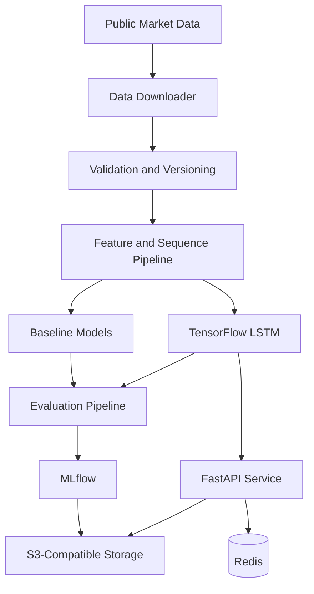

# Stock Market Price Prediction

An educational time-series forecasting system designed to compare simple statistical baselines with a TensorFlow LSTM using chronological evaluation, reproducible data pipelines, experiment tracking, and API-based inference.

The project demonstrates time-series machine learning, leakage-safe validation, baseline comparison, model versioning, FastAPI development, caching, object storage, containerization, automated testing, and responsible communication of financial-model limitations.

[](https://www.python.org/)
[](https://www.tensorflow.org/)
[](https://fastapi.tiangolo.com/)
[](https://mlflow.org/)
[](https://redis.io/)
[](https://www.docker.com/)

> **Current status:** The data pipeline, model architecture, API, and evaluation workflow are being finalized. This README describes the confirmed public scope. Source code, verified setup instructions, model results, charts, tests, and benchmarks will be published only after they are reproducible from this repository.

> **Financial disclaimer:** This project is intended solely for software-engineering, machine-learning, and educational demonstration. It does not provide financial, investment, trading, or portfolio-management advice. Model outputs must not be used to make real financial decisions.

---

## Overview

Stock prices are noisy, non-stationary, and influenced by events that historical price sequences alone cannot fully represent. For this reason, this project does not present an LSTM as a reliable market-prediction system.

Instead, the project is designed as a reproducible ML engineering platform for answering a more disciplined question:

> Does a trained LSTM outperform simple forecasting baselines when evaluated chronologically on unseen historical data?

The completed system will download and version public market data, create leakage-safe time-series sequences, train baseline and LSTM models, track experiments with MLflow, expose model inference through FastAPI, and generate evaluation reports from reproducible scripts.

---

## Problem Statement

Many stock-prediction demonstrations produce attractive charts but use evaluation methods that can create misleading results.

Common problems include:

* Randomly splitting time-series records
* Fitting scalers on the entire dataset
* Evaluating only one stock or time period
* Comparing predictions only through visual similarity
* Ignoring naive forecasting baselines
* Reporting a single metric
* Selecting a model using test-set performance
* Hiding poor directional accuracy
* Using future information during feature generation
* Presenting historical backtests as guaranteed future performance

This project addresses these issues through chronological evaluation, baseline comparison, documented preprocessing, multiple metrics, and explicit limitations.

---

## Planned Release Scope

### Market Data Pipeline

* Reproducible public-data downloader
* Configurable ticker and date range
* Local data caching
* Raw and processed dataset versioning
* Schema and timestamp validation
* Duplicate-date detection
* Missing-record reporting
* Chronological sorting
* Documented source and usage terms
* S3-compatible artifact storage

### Preprocessing

* Configurable lookback window
* Time-series sequence generation
* Train-only scaler fitting
* Chronological train, validation, and test partitions
* Inverse transformation for evaluation
* Reproducible random seeds
* Saved preprocessing artifacts
* Leakage-validation checks

### Forecasting Baselines

The LSTM will be compared against simple baselines, including:

* Previous-value persistence
* Moving-average forecast
* Optional linear regression baseline
* Historical mean where contextually appropriate

A complex model will not be described as successful unless it demonstrates measurable improvement over appropriate baselines.

### TensorFlow LSTM

The target neural-network implementation will include:

* Stacked LSTM layers
* Dropout regularization
* Dense regression output
* Configurable sequence length
* Configurable hidden dimensions
* Early stopping
* Model checkpointing
* Learning-rate configuration
* Batch-size and epoch tracking
* Saved model artifacts

### Evaluation

The evaluation pipeline will generate:

* Mean Absolute Error
* Root Mean Squared Error
* Mean Absolute Percentage Error
* Directional accuracy
* Baseline-relative improvement
* Training and validation loss
* Inference latency
* Actual-versus-predicted charts
* Residual analysis
* Error distribution
* Performance by time period

Every published result will include the ticker, date range, dataset version, split boundaries, hardware context, model parameters, and random seed.

### Inference API

The FastAPI service will provide:

* Supported ticker information
* Historical-data retrieval
* Model metadata
* Versioned prediction requests
* Input validation
* Health and readiness endpoints
* Structured error responses
* Redis-backed recent-query caching
* Generated OpenAPI documentation

---

## Architecture



---

## Component Responsibilities

| Component              | Responsibility                                         |
| ---------------------- | ------------------------------------------------------ |
| Data downloader        | Obtains reproducible public historical data            |
| Validation layer       | Checks schema, dates, duplicates and missing values    |
| Preprocessing pipeline | Creates chronological splits and time-series sequences |
| Baseline models        | Establish minimum forecasting performance              |
| TensorFlow LSTM        | Learns sequential relationships from training data     |
| Evaluation pipeline    | Calculates metrics and generates analytical plots      |
| MLflow                 | Tracks parameters, metrics, models and artifacts       |
| FastAPI                | Provides model metadata and inference endpoints        |
| Redis                  | Caches recent data and inference queries               |
| S3-compatible storage  | Stores versioned data and model artifacts              |
| Docker                 | Provides a reproducible runtime environment            |

---

## Technology Stack

### Machine Learning

* Python
* TensorFlow
* Keras
* scikit-learn
* pandas
* NumPy
* LSTM networks
* Time-series preprocessing

### Backend

* FastAPI
* Pydantic
* REST APIs
* OpenAPI
* Structured validation
* Health and readiness checks

### Experiment and Artifact Management

* MLflow
* S3-compatible object storage
* MinIO for local development
* Versioned model artifacts
* Versioned preprocessing artifacts

### Data and Caching

* Public historical market data
* Local dataset cache
* Redis
* Serialized preprocessing metadata

### Infrastructure and Quality

* Docker
* Docker Compose
* GitHub Actions
* PyTest
* Dependency and security checks
* Structured logging

---

## Intended Project Structure

```text
Stock-Market-Price-Prediction/
├── app/
│   ├── api/
│   ├── core/
│   ├── models/
│   ├── schemas/
│   └── services/
├── configs/
├── data/
│   ├── raw/
│   └── processed/
├── docs/
├── ml/
│   ├── data/
│   ├── evaluation/
│   ├── features/
│   ├── models/
│   └── training/
├── notebooks/
├── scripts/
├── tests/
├── .env.example
├── docker-compose.yml
├── Dockerfile
├── LICENSE
└── README.md
```

Generated datasets, large model artifacts, credentials, and local MLflow runs will not be committed unless they are intentionally small, licensed, and required for a reproducible demonstration.

---

## Model Development Workflow

1. Download a configured ticker’s historical data.
2. Validate dates, required columns, duplicates, and missing values.
3. Sort all observations chronologically.
4. Divide data into train, validation, and test periods.
5. Fit preprocessing transformations using training data only.
6. Generate fixed-length sequences without crossing split boundaries.
7. Train persistence and moving-average baselines.
8. Train the TensorFlow LSTM using the training and validation sets.
9. Select configuration without examining test performance.
10. Evaluate all models on the untouched chronological test set.
11. Log parameters, metrics and artifacts through MLflow.
12. Register the selected model and preprocessing version.
13. Serve versioned inference through FastAPI.
14. Monitor latency, errors and input drift indicators.

---

## Leakage Prevention

The project will include checks to prevent:

* Random train/test splitting
* Scaler fitting on validation or test data
* Future observations entering historical windows
* Overlapping sequences crossing split boundaries
* Target-derived feature leakage
* Test-set use during hyperparameter selection
* Hidden manual changes to evaluation periods

The exact date boundaries for training, validation and testing will be stored with every experiment.

---

## Testing Strategy

The completed release will include:

### Data Tests

* Required-column validation
* Timestamp-order validation
* Duplicate-date detection
* Missing-value handling
* Sequence-shape verification
* Chronological split validation
* Scaler leakage regression tests

### Model Tests

* LSTM architecture verification
* Input and output shape tests
* Training smoke test
* Model serialization and loading
* Baseline calculation tests
* Metric calculation tests
* Deterministic seed checks where practical

### API Tests

* Health and readiness endpoints
* Supported ticker requests
* Valid prediction requests
* Invalid ticker and date handling
* Model-version validation
* Cache success and failure behavior
* Structured error responses

### Integration Tests

* MLflow experiment logging
* S3-compatible artifact storage
* Redis caching
* Docker service health
* End-to-end training and inference smoke test

---

## Evaluation Principles

A model will not be described as successful simply because its prediction line appears close to the historical price line.

The final evaluation will answer:

* Does the LSTM outperform persistence?
* Does it outperform a moving-average baseline?
* Is the improvement consistent across time periods?
* How sensitive is performance to the random seed?
* What happens during high-volatility periods?
* What is the directional accuracy?
* How large are the worst prediction errors?
* How expensive is training and inference?
* Does performance remain stable across supported tickers?

Negative or inconclusive results will be reported honestly.

---

## API Scope

The target API will support endpoints similar to:

| Endpoint                       | Purpose                         |
| ------------------------------ | ------------------------------- |
| `GET /health`                  | Application health              |
| `GET /ready`                   | Model and dependency readiness  |
| `GET /api/v1/tickers`          | Supported ticker information    |
| `GET /api/v1/history/{ticker}` | Validated historical data       |
| `GET /api/v1/models`           | Available model versions        |
| `GET /api/v1/models/{version}` | Model metadata and evaluation   |
| `POST /api/v1/predict`         | Generate a model prediction     |
| `GET /api/v1/experiments/{id}` | Retrieve experiment information |

The final endpoint paths will be documented from the implemented OpenAPI schema.

---

## Local Development

The completed release will run through Docker Compose with:

* FastAPI application
* Redis
* Local MLflow tracking
* MinIO for S3-compatible storage
* Reproducible training scripts
* Health checks

The public implementation will include:

* Deterministic dependency files
* `.env.example`
* Data-download command
* Baseline-training command
* LSTM-training command
* Evaluation command
* API startup command
* Test command
* Docker startup instructions

Exact commands will be published after they are validated from a clean clone.

---

## Observability

The application is intended to record:

* API request count and latency
* Prediction latency
* Model version used
* Cache hit and miss rates
* Data-download failures
* Model-loading failures
* Input validation failures
* Training duration
* Evaluation duration
* Dataset and artifact versions

Sensitive environment values will never be included in logs.

---

## Limitations

* Historical performance does not guarantee future results.
* Stock prices are influenced by events not represented in historical price sequences.
* The model cannot reliably account for news, regulation, earnings surprises, macroeconomic events or market manipulation.
* A low regression error does not imply profitable trading performance.
* Directional accuracy may remain close to chance.
* Results may vary substantially across tickers and market regimes.
* Transaction fees, taxes, liquidity, slippage and execution delays are outside the initial scope.
* The application is not a trading platform.
* The application does not execute trades or connect to brokerage accounts.

---

## Release Requirements

The first public implementation release will be considered complete when:

* Historical data can be downloaded reproducibly
* Dataset sources and usage terms are documented
* Chronological splits are enforced
* Preprocessing is fitted only on training data
* Persistence and moving-average baselines are implemented
* A real stacked TensorFlow LSTM is trained
* Baseline and LSTM evaluations are reproducible
* Metrics and charts are generated by scripts
* MLflow records parameters, metrics and artifacts
* FastAPI serves model metadata and inference
* Redis and local object storage integrations work
* Unit, API and integration tests pass
* Docker Compose starts the local platform
* Financial limitations are clearly documented
* The repository contains no credentials or unsupported claims

---

## Project Goals

This project is intended to demonstrate practical experience with:

* Time-series machine learning
* TensorFlow and LSTM architecture
* Leakage-safe model evaluation
* Baseline-driven experimentation
* MLflow experiment tracking
* Model and artifact versioning
* FastAPI development
* Redis caching
* S3-compatible storage
* Docker-based development
* Automated testing and CI/CD
* Responsible communication of model limitations

---

## Data Attribution

The public implementation will document:

* Market-data provider
* Dataset fields
* Supported tickers
* Requested date ranges
* Download date
* Usage and redistribution terms
* Cleaning and transformation steps
* Missing-data handling
* Split boundaries

Raw market data will not be redistributed if the provider’s terms prohibit redistribution.

---

## Author

**Shriya Patel**

Software Engineer focused on backend systems, distributed architecture, cloud infrastructure, data platforms, and AI-enabled applications.

* GitHub: [spatel842002](https://github.com/spatel842002)
* Portfolio: [shriya-patel-software-portfolio.vercel.app](https://shriya-patel-software-portfolio.vercel.app/)
* Email: [spatel842002@gmail.com](mailto:spatel842002@gmail.com)

---

## License

The original application source code is intended to be released under the MIT License. Market-data licensing and usage terms will remain separate from the source-code license.

A complete `LICENSE` file and data-attribution documentation will be included with the public implementation release.
